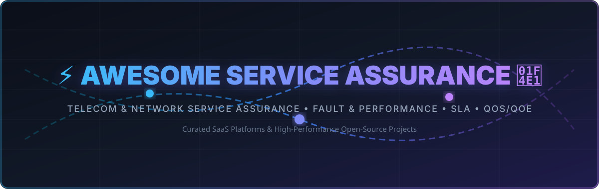

# ⚡ Awesome Service Assurance 📡

  

  
  
  
  
  
  
  

---

## 📖 Overview & Purpose

A curated list of **SaaS Platforms & Open-Source Projects** focused on **Telecom & Network Service Assurance**, **Fault Management**, **Performance Monitoring**, **SLA Management**, **QoS/QoE**, **Root-Cause Analysis (RCA)**, and **OSS Monitoring**.

These systems empower Communications Service Providers (CSPs), Managed Service Providers (MSPs), and enterprise network operators to monitor service health, detect infrastructure anomalies, assure strict SLAs, and deliver zero-outage customer experiences across fixed, 5G mobile, fiber, and multi-cloud networks.

---

## 🏷️ Table of Contents

- [☁️ SaaS & Hosted Platforms](#️-saas--hosted-platforms)
- [🔓 Open-Source GitHub Projects](#-open-source-github-projects)
- [🛠️ Key OSS Architectural Components](#️-key-oss-architectural-components)
- [🤝 How to Contribute](#-how-to-contribute)
- [📈 Star History](#-star-history)
- [📜 Disclaimer](#-disclaimer)

---

## ☁️ SaaS & Hosted Platforms

> 📊 **Market Size & Structure**: The global Telecommunications & Network Service Assurance market size is estimated at **$7.5 Billion to $10+ Billion**, projected to expand to **$15+ Billion by 2030** (CAGR ~9.5%). The sector is **moderately fragmented**, balancing legacy telecom domain giants (Amdocs, Nokia, Ericsson) with full-stack observability & digital experience monitoring leaders (Cisco ThousandEyes, Datadog, Dynatrace, IBM Instana).

*Sorted by **Company Size (Market Capitalization / Valuation / Annual Revenue)** in descending order:*

| Platform / Product | Description | Company Size (Market Cap / Revenue) | Starting Pricing | Free Tier / Free Trial Limits |
| :--- | :--- | :--- | :--- | :--- |
| **[Cisco ThousandEyes / Accedian](https://www.thousandeyes.com/)** | Network digital experience monitoring, synthetic probes, latency & hop-by-hop visibility across WAN, fiber, and 5G. | $435B Market Cap ($56.6B Revenue) | $0.82 / unit / month | 15-day free trial (includes up to 50,000 test units) |
| **[IBM Instana Observability](https://www.ibm.com/instana)** | Automated continuous monitoring, microservice topology discovery, and root-cause analysis for network service assurance. | $221B Market Cap ($67.5B Revenue) | $75 / host / month | 14-day free trial (full feature access across all monitored nodes) |
| **[Datadog Network Monitoring](https://www.datadoghq.com/)** | Cloud Network Monitoring & Network Device Monitoring for real-time traffic flow and topology assurance across multi-cloud. | $76B Market Cap ($3.97B Revenue) | $5 / host / month | Free forever: up to 5 hosts with 1-day metric retention (or 14-day full-feature trial) |
| **[Nokia AVA Service Assurance](https://www.nokia.com/)** | Cloud-native multi-domain service assurance, AI-assisted root cause analysis, and automated 5G slice SLA management. | $56B Market Cap (€19.8B Revenue) | $500 / month | 30-day free trial (up to 20 network slice instances) |
| **[Ericsson Expert Analytics](https://www.ericsson.com/)** | Analytics-driven service assurance and customer experience solutions leveraging telecom network domain expertise & AI. | $33B Market Cap ($23B Revenue) | $800 / month | 14-day free trial (sandbox evaluation for up to 10 cell clusters) |
| **[Dynatrace Network Monitoring](https://www.dynatrace.com/)** | AI-driven infrastructure and network performance monitoring providing automated topology discovery and fault analysis. | $15B Market Cap ($1.9B Revenue) | $29 / host / month | 15-day free trial (includes up to 1,000 host-hours of monitoring) |
| **[Site24x7 Network Monitoring](https://www.site24x7.com/)** | Cloud-based SNMP, traffic flow, and device performance monitoring for multi-vendor network service assurance. | $10B+ Valuation ($1.2B+ Revenue) | $9 / month | 30-day free trial (up to 10 monitoring nodes); auto-downgrades to Free plan |
| **[ManageEngine OpManager Cloud](https://www.manageengine.com/network-monitoring/)** | Cloud-based network performance monitoring, fault management, bandwidth analysis, and configuration assurance. | $10B+ Valuation ($1.2B+ Revenue) | $102.75 / month | 30-day free trial (full features for up to 50 devices pack); Free Edition allows 3 devices free forever |
| **[Amdocs Helix Service Assurance](https://www.amdocs.com/)** | Comprehensive telecom service assurance portfolio covering fault, performance, quality of experience, and automated orchestration. | $10B Market Cap ($4.9B Revenue) | $1,500 / month | 14-day free trial (POC sandbox up to 5 node connectors) |
| **[New Relic Network Performance Monitoring](https://newrelic.com/)** | Unified network telemetry, synthetic monitoring, and service health assurance integrated with full-stack observability. | $6.5B Valuation ($920M Revenue) | $10 / month | Free forever: 100 GB/month data ingest + 1 full platform user |
| **[SolarWinds Observability SaaS](https://www.solarwinds.com/)** | Full-stack SaaS network and infrastructure monitoring, active probing, and service quality assurance. | $2.5B Market Cap ($780M Revenue) | $5 / host / month | 30-day free trial (full feature access across monitored nodes) |
| **[LogicMonitor](https://www.logicmonitor.com/)** | Automated, agentless network performance monitoring, SLA tracking, and topology mapping for IT and telecom networks. | $2.4B Valuation ($250M Revenue) | $16 / hybrid unit / month | 15-day free trial (full platform features across infrastructure) |
| **[Viavi Observer SaaS](https://www.viavisolutions.com/)** | Enterprise network performance monitoring, packet capture analysis, and 5G service quality assurance cloud suite. | $2.1B Market Cap ($1.1B Revenue) | $100 / month | 14-day free trial (includes up to 10 virtual probes) |
| **[EXFO Exchange](https://www.exfo.com/)** | Cloud-hosted test data management, automated workflow, and fiber/5G network service quality assurance platform. | $1.4B Valuation ($320M Revenue) | $49 / user / month | 30-day free trial (full test data sync & analytics for up to 5 users) |
| **[Spirent CloudSim / TestCenter SaaS](https://www.spirent.com/)** | Automated network testing, 5G slice assurance, and synthetic traffic validation cloud service. | $1.2B Valuation ($540M Revenue) | $150 / month | 30-day free trial (includes up to 100 automated test runs) |
| **[Kentik Network Observability](https://www.kentik.com/)** | SaaS network traffic intelligence, BGP route analytics, and cloud network observability for service providers and enterprises. | $800M Valuation ($60M Revenue) | $249 / month | 30-day free trial (full flow ingestion and network traffic analytics) |
| **[Subex HyperSense](https://www.subex.com/)** | AI-driven telecom service assurance, fraud management, and network analytics cloud platform. | $400M Valuation ($50M Revenue) | $300 / month | 14-day free trial (includes up to 50,000 event streams) |
| **[Infovista Planet / Assurance Cloud](https://www.infovista.com/)** | Network lifecycle planning, optimization, and real-time SLA/QoE service assurance cloud platform. | $350M Valuation ($150M Revenue) | $250 / month | 14-day free trial (up to 10 cell site assurance models) |
| **[Auvik Network Management](https://www.auvik.com/)** | Cloud-based network visibility, automated configuration backups, traffic analysis, and performance troubleshooting. | $300M Valuation ($40M Revenue) | $175 / month | 14-day free trial (full feature access across all network devices) |
| **[Netcracker Cloud Assurance](https://www.netcracker.com/)** | Digital OSS/BSS-aligned service assurance platform supporting cloud-native and multi-vendor network environments. | $250M Division Revenue (NEC $25B) | $1,000 / month | 14-day free trial (sandbox evaluation up to 25 network elements) |
| **[Paessler PRTG Hosted Monitor](https://www.paessler.com/prtg)** | Turnkey cloud-hosted network monitoring for availability, traffic, QoS, and bandwidth assurance across IT/telecom infrastructure. | $80M Valuation ($45M Revenue) | $67 / month | 10-day free trial (full feature access for up to 500 sensors) |
| **[Domotz Network Management](https://www.domotz.com/)** | SaaS network monitoring, automated asset discovery, SNMP monitoring, and security assurance for network infrastructure. | $50M Valuation ($15M Revenue) | $35 / collector / month | 14-day free trial (unlimited devices per collector, no credit card required) |

---

## 🔓 Open-Source GitHub Projects

*Sorted by **GitHub Star Count** in descending order:*

- **[Grafana](https://github.com/grafana/grafana)**   
  De-facto open-source operational dashboard, metric visualization, and multi-source analytics engine widely used for service health dashboards.

- **[Prometheus](https://github.com/prometheus/prometheus)**   
  Industry standard open-source metric collection, time-series storage, and alerting framework powering modern cloud and OSS monitoring.

- **[Jaeger](https://github.com/jaegertracing/jaeger)**   
  CNCF open-source end-to-end distributed tracing system for microservice latency, bottleneck analysis, and transaction assurance.

- **[NetBox](https://github.com/netbox-community/netbox)**   
  Open-source infrastructure resource modeling platform (IPAM & DCIM) serving as the single source of truth for network topology & automation.

- **[Fluentd](https://github.com/fluent/fluentd)**   
  Open-source unified data collector providing log parsing, buffering, and telemetry stream distribution.

- **[Wireshark](https://github.com/wireshark/wireshark)**   
  World standard open-source network protocol analyzer, deep packet inspection, and packet capture troubleshooting tool.

- **[Zabbix](https://github.com/zabbix/zabbix)**   
  Enterprise open-source monitoring software for networks, servers, virtual machines, and cloud availability assurance.

- **[OpenTelemetry Collector](https://github.com/open-telemetry/opentelemetry-collector)**   
  High-performance, vendor-agnostic proxy to receive, process, and export telemetry data (metrics, logs, traces) across service boundaries.

- **[LibreNMS](https://github.com/librenms/librenms)**   
  Autodiscovering PHP/MySQL/SNMP network monitoring system with active alert rules, billing modules, and interface graph visualization.

- **[Nagios Core](https://github.com/NagiosEnterprises/nagioscore)**   
  Established open-source host, service, and network infrastructure availability monitoring engine.

- **[Icinga 2](https://github.com/Icinga/icinga2)**   
  Scalable open-source monitoring system checking resource availability, performance metrics, and sending automated operational notifications.

- **[Cacti](https://github.com/Cacti/cacti)**   
  Robust open-source network graphing solution utilizing RRDTool to monitor bandwidth usage, interface stats, and SNMP targets.

- **[LibreQoS](https://github.com/LibreQoE/LibreQoS)**   
  Open-source traffic management and network operations platform for ISPs, focused on QoE, bufferbloat reduction, and subscriber visibility.

- **[OpenNMS Horizon](https://github.com/OpenNMS/opennms)**   
  Enterprise-grade open-source network management platform providing fault management, performance monitoring, event correlation, and inventory.

- **[NOC Project](https://github.com/gufolabs/noc)**   
  Full-featured open-source Operation Support System (OSS) for telecom and enterprise NOCs, featuring Fault, Performance, Inventory, and Topology.

- **[Observium](https://github.com/observium/observium)**   
  Autodiscovering network monitoring platform providing intuitive web interface for device health and network traffic visualization.

- **[Boda Telecom Suite (BTS-CE)](https://github.com/bodastage/bts-ce)**   
  Open-source telecommunication network management platform focused on RAN configuration management, network audit, and topology.

- **[NMS Prime / CableLabs OS Provisioning](https://github.com/cablelabs/os-provisioning)**   
  Open-source network management and provisioning platform supporting DOCSIS, FTTH, DSL, and wireless access networks.

---

## 🛠️ Key OSS Architectural Components

When engineering a custom service assurance stack, architectural components are layered as follows:
- **Telemetry & Flow Collectors**: NetFlow, IPFIX, sFlow, gNMI, and gRPC streaming telemetry ingestion.
- **Topology & Discovery Engines**: Graph-based network relationship mapping (NetBox, NOC Project).
- **Event Correlation & Root-Cause Engines**: Rule-based & machine-learning fault suppression and alarm deduction.
- **Service Level Agreement (SLA) & QoE Engine**: Synthetic testing, latency probing, and subscriber experience measurement.

---

## 🤝 How to Contribute

1. Fork the repository on GitHub.
2. Add your SaaS or Open-Source project entry in [`README.md`](file:///C:/Users/hp/Documents/Projects/Awesome-Service-Assurance/README.md).
3. Include project name, official website/repository URL, 1–2 sentence factual summary, starting price, and free tier/trial details.
4. Submit a Pull Request (PR) with a brief summary of the changes.

Feel free to check out [Awesome-Awesome-Awesome](https://github.com/ishandutta2007/Awesome-Awesome-Awesome) for more awesome lists!

---

## 📈 Star History

---

## 📜 Disclaimer

- This is a community-curated collection intended for software evaluation and network architecture reference.
- Service assurance platforms operate in mission-critical CSP environments; deployments require verification of multi-vendor mediation, carrier-grade redundancy, and security compliance.
